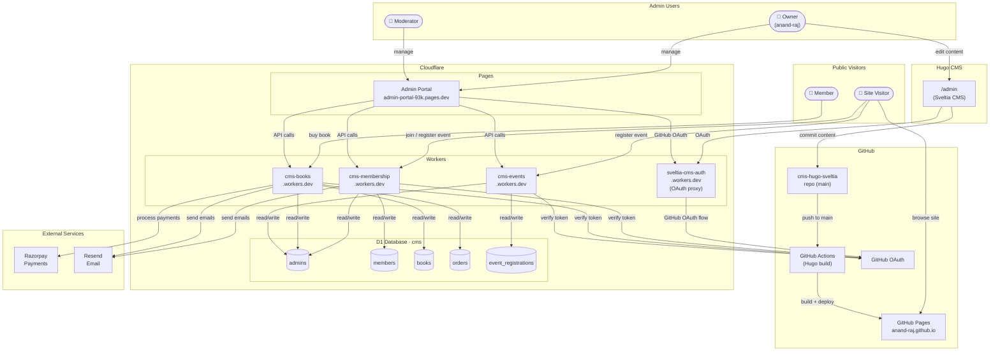

# System Architecture



## Components

### Hosting
| Component | Platform | URL |
|---|---|---|
| Hugo static site | GitHub Pages | `https://anand-raj.github.io` |
| Admin portal | Cloudflare Pages | `https://admin-portal-93k.pages.dev` |

### Cloudflare Workers
| Worker | Purpose | URL |
|---|---|---|
| `cms-membership` | Member signup, approval, newsletter, reminders | `https://cms-membership.e-anandraj.workers.dev` |
| `cms-books` | Book catalog, Razorpay order creation + verification | `https://cms-books.e-anandraj.workers.dev` |
| `cms-events` | Event registration, confirm/cancel | `https://cms-events.e-anandraj.workers.dev` |
| `sveltia-cms-auth` | GitHub OAuth proxy for CMS and admin portal login | `https://sveltia-cms-auth.e-anandraj.workers.dev` |

### Database (Cloudflare D1)
Single database `cms` (`3d9706db-0a45-4c18-ac40-3b477cb0c915`):

| Table | Used by | Purpose |
|---|---|---|
| `admins` | All workers | Admin portal access control |
| `members` | cms-membership | Site membership records |
| `books` | cms-books | Book catalog |
| `orders` | cms-books | Purchase orders |
| `event_registrations` | cms-events | Event sign-ups |

### External Services
| Service | Purpose |
|---|---|
| Razorpay | Payment processing for book orders |
| Resend | Transactional emails (membership approval, reminders) |
| GitHub OAuth | Identity for both CMS editors and admin portal users |

## Auth Flow

### Admin Portal Login
1. User clicks Login → GitHub OAuth popup via `sveltia-cms-auth`
2. GitHub issues an access token
3. Portal sends token with every API request (`Authorization: token ...`)
4. Worker calls `api.github.com/user` to resolve the GitHub login (cached 5 min)
5. Worker looks up login in `admins` table — grants or denies access

### Adding a New Admin
```bash
NODE_TLS_REJECT_UNAUTHORIZED=0 npx wrangler d1 execute cms --remote \
  --command "INSERT INTO admins (github_login, role, added_at) VALUES ('username', 'moderator', datetime('now'))"
```
Roles: `owner` (full access + can add/remove admins) · `moderator` (view + approve/reject)
